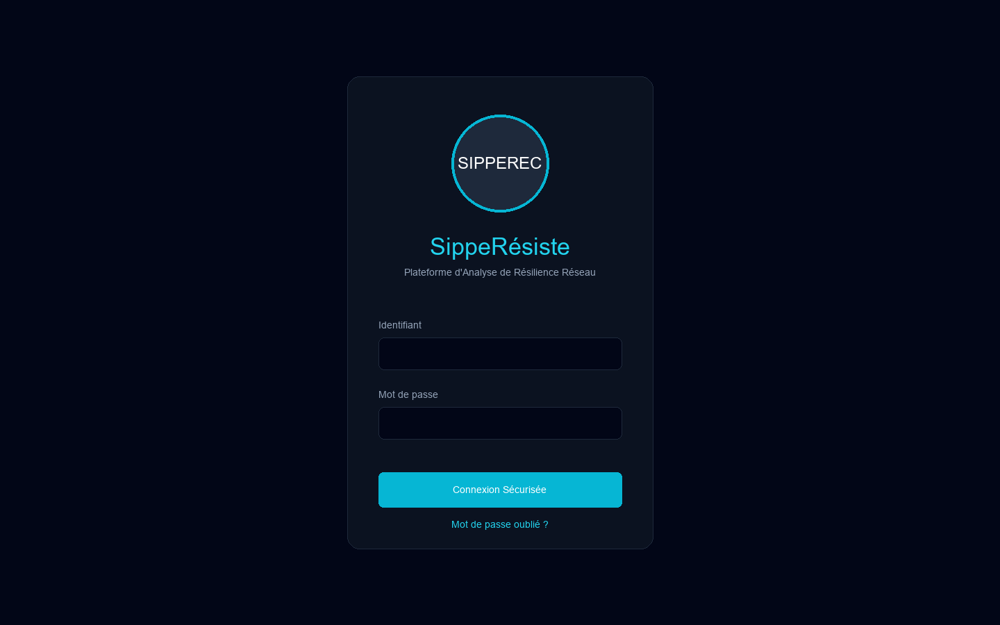
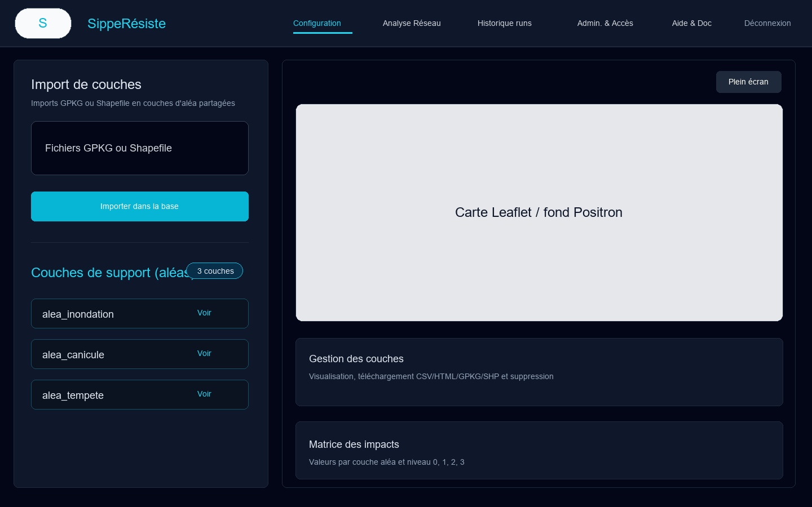
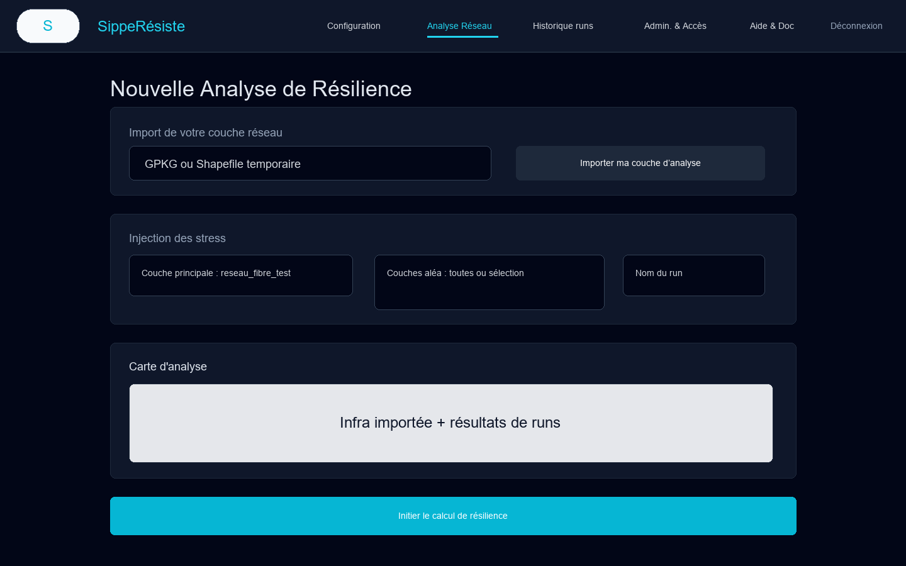
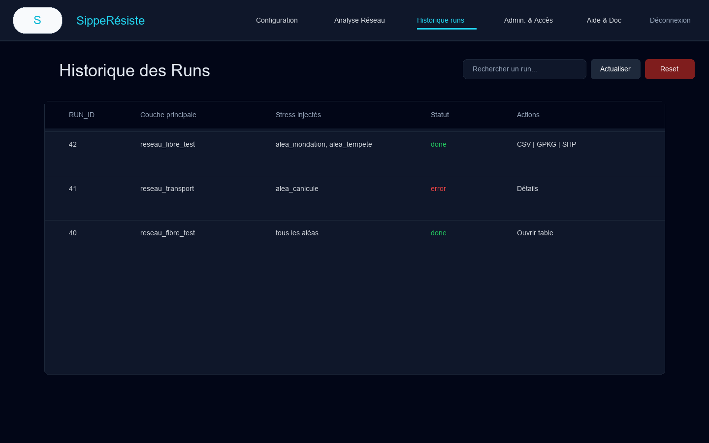
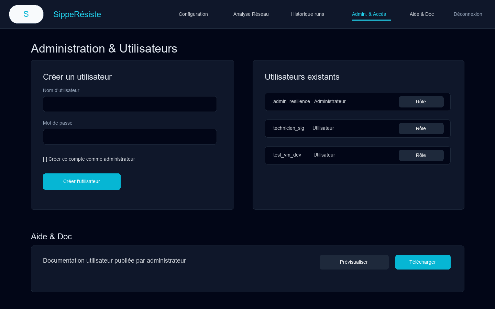
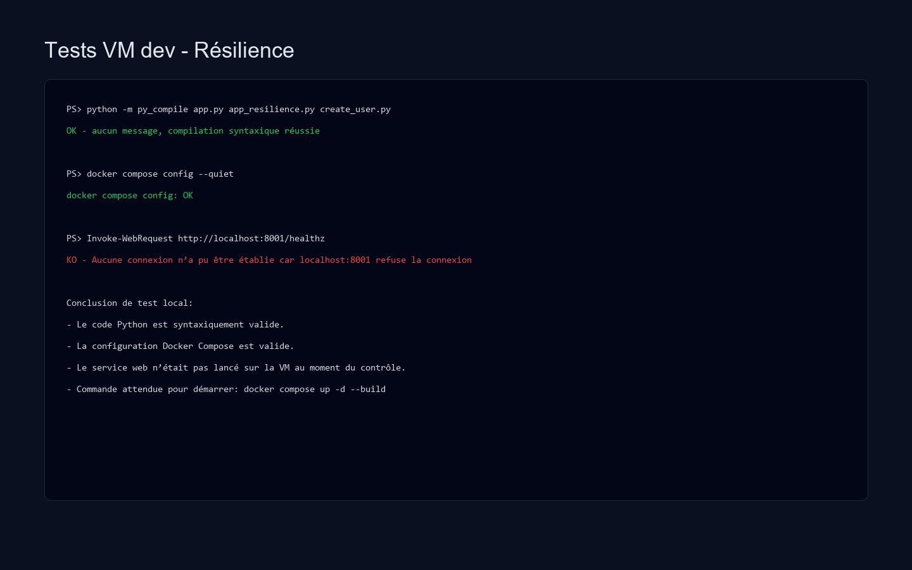

# Documentation technique - Application Resilience SippeResiste

Date de redaction : 15 juin 2026  
Environnement documente : VM dev/test locale, dossier `interface-local`

## 1. Objet du document

Ce document explique comment l'application **Resilience SippeResiste** a ete developpee, comment elle est organisee techniquement, comment elle est deployee sur la VM de developpement/test, et quels tests de controle ont ete executes.

L'application est une application web Flask dediee a l'analyse de resilience reseau. Elle permet :

- de se connecter avec un compte local ;
- d'importer des couches d'alea au format GPKG ou Shapefile ;
- d'importer une couche reseau temporaire pour une analyse utilisateur ;
- de croiser la couche reseau avec les aleas via PostGIS ;
- de produire un resultat de run exportable en CSV, GPKG ou Shapefile ;
- de consulter l'historique des runs ;
- d'administrer les utilisateurs et la documentation publiee.

## 2. Organisation du projet

Racine applicative :

```text
interface-local/
  app.py
  app_resilience.py
  create_user.py
  Dockerfile
  docker-compose.yml
  render.yaml
  requirements.txt
  requirements.docker.txt
  README.md
  db/init_resilience/00_init_postgis.sql
  scripts/dump.sh
  scripts/restore.sh
  static/css/
  static/js/resilience.js
  templates/
  uploads/
  temp_shapefiles/
```

Role des principaux fichiers :

| Fichier | Role |
|---|---|
| `app.py` | Application Flask principale : routes, authentification, import geospatial, calcul PostGIS, exports, historique et administration. |
| `app_resilience.py` | Point d'entree isole pour l'application Resilience. Il redirige `/` vers `/resilience` et bloque les routes hors perimetre. |
| `templates/resilience.html` | Interface principale : onglets Configuration, Analyse Reseau, Historique, Admin & Acces, Aide & Doc. |
| `templates/login_resilience.html` | Page de connexion specifique Resilience. |
| `static/js/resilience.js` | Logique front-end : Leaflet, uploads, appels API, historique, matrice d'impacts, evenements SSE. |
| `Dockerfile` | Image Python 3.11 avec dependances systeme SIG, GDAL, PostGIS client, LibreOffice et Gunicorn. |
| `docker-compose.yml` | Deploiement local VM : service web Flask/Gunicorn + base PostGIS. |
| `db/init_resilience/00_init_postgis.sql` | Initialisation Postgres : extension PostGIS et schema `resilience`. |
| `create_user.py` | Creation d'un utilisateur applicatif dans la base. |

## 3. Architecture technique

L'application suit une architecture simple :

```text
Navigateur
  |
  | HTTP / SSE / fetch JSON
  v
Gunicorn + Flask
  |
  | SQLAlchemy / psycopg2 / GeoPandas / OGR
  v
PostgreSQL + PostGIS
```

Dans Docker Compose, deux conteneurs sont utilises :

- `telecom_web_resilience` : service web Flask lance par Gunicorn ;
- `telecom_db_resilience` : base PostgreSQL/PostGIS.

Le service web est expose sur la VM via le port hote `8001`, qui pointe vers le port conteneur `8000`.

URL locale attendue :

```text
http://localhost:8001/resilience
```

Sonde de sante :

```text
http://localhost:8001/healthz
```

## 4. Configuration applicative

Le fichier `.env` local contient les variables propres a la VM dev/test :

```env
SECRET_KEY=change-me-please
DB_USERNAME_RESILIENCE=app
DB_PASSWORD_RESILIENCE=app
DB_NAME_RESILIENCE=telecom_resilience_db
RESET_LINK_VIA_UI=1
```

Dans `docker-compose.yml`, ces variables sont mappees vers les variables consommees par Flask :

```env
DB_HOST=db_resilience
DB_PORT=5432
DB_USERNAME=app
DB_PASSWORD=app
DB_NAME=telecom_resilience_db
DB_SEARCH_PATH=resilience,public
AUTH_SCHEMA=resilience
LOGIN_TEMPLATE=login_resilience.html
RESET_LINK_VIA_UI=1
```

La chaine SQLAlchemy construite par `app.py` est de type :

```text
postgresql://<user>:<password>@<host>:<port>/<database>?options=-csearch_path%3Dresilience,public
```

## 5. Developpement de l'application

### 5.1 Backend Flask

Le backend est developpe avec Flask 3.1 et Flask-SQLAlchemy. Les points importants sont :

- `app.py` instancie `Flask`, configure SQLAlchemy et cree un moteur SQLAlchemy direct pour les traitements SQL/PostGIS avances.
- un middleware `before_request` protege toutes les routes non publiques ;
- les routes publiques sont limitees a `/healthz`, `/login`, `/logout`, `/forgot`, `/reset/<token>`, `/image/...` et certains assets statiques ;
- `app_resilience.py` ajoute un second middleware pour isoler l'application Resilience : toute route hors perimetre retourne une erreur 404 JSON.

Routes principales :

| Route | Role |
|---|---|
| `GET /healthz` | Controle applicatif et connexion DB. |
| `GET/POST /login` | Connexion utilisateur. |
| `GET /logout` | Deconnexion. |
| `GET /resilience` | Page principale de l'application. |
| `POST /upload_resilience` | Import des couches d'alea partagees. |
| `POST /upload_resilience_analysis_layer` | Import temporaire de la couche reseau utilisateur. |
| `GET /resilience_layers` | Liste des couches partagees. |
| `GET /resilience_layers_support` | Liste des couches d'alea disponibles. |
| `GET /resilience_layer_data/<layer_name>` | Donnees attributaires et GeoJSON d'une couche. |
| `GET/POST /resilience_impact_matrix` | Lecture et sauvegarde de la matrice d'impacts. |
| `GET /alea_view_batch_stream` | Calcul de resilience en streaming SSE. |
| `GET /resilience_runs_history` | Historique des runs. |
| `POST /resilience_runs_delete` | Suppression de runs selectionnes. |
| `POST /resilience_runs_reset` | Reinitialisation de l'historique. |
| `GET /download_resilience_layer/<layer>` | Exports CSV, HTML, GPKG ou Shapefile. |

### 5.2 Frontend

Le frontend est rendu par Jinja/Tailwind et anime par JavaScript natif.

Bibliotheques cote navigateur :

- Tailwind CSS via CDN ;
- Leaflet via CDN ;
- fonds cartographiques Carto Positron ;
- appels `fetch` pour les APIs JSON ;
- `EventSource` pour suivre en temps reel le calcul de resilience.

L'ecran principal est organise en onglets :

- **Configuration** : import et gestion des couches d'alea ;
- **Analyse Reseau** : import d'une couche reseau temporaire, choix des aleas, lancement du calcul ;
- **Historique runs** : consultation, recherche, exports et suppression ;
- **Admin. & Acces** : creation d'utilisateurs et gestion du role admin ;
- **Aide & Doc** : document utilisateur diffuse par l'administrateur.

## 6. Gestion des donnees geospatiales

Formats acceptes :

- `.gpkg` ;
- Shapefile complet : `.shp`, `.shx`, `.dbf`, avec fichiers annexes optionnels `.prj`, `.cpg`, `.sbn`, `.sbx`.

Les imports sont securises par :

- `secure_filename` pour les noms de fichiers ;
- validation des extensions ;
- detection des shapefiles incomplets ;
- normalisation des noms de couches ;
- verification des doublons ;
- import dans le schema `resilience`.

Les traitements geospatiaux reposent sur :

- GeoPandas ;
- GDAL/OGR ;
- Shapely ;
- PyProj ;
- PostGIS.

## 7. Calcul de resilience

Le calcul principal est declenche par :

```text
GET /alea_view_batch_stream?main_layer=<couche>&view_name=<nom_run>&alea_tables=<liste_optionnelle>
```

Fonctionnement :

1. L'utilisateur importe une couche reseau temporaire dans l'onglet Analyse.
2. L'utilisateur choisit toutes les couches d'alea ou une selection manuelle.
3. Le backend importe temporairement la couche reseau dans PostGIS.
4. Pour chaque couche d'alea, PostGIS calcule les intersections avec `ST_Intersects`.
5. Le niveau d'alea est associe a une valeur d'impact depuis `resilience.impact_matrix`.
6. Les colonnes d'alea, d'impact et la colonne `somme` sont produites.
7. Le resultat final est enregistre dans une table privee liee a l'utilisateur.
8. Le run est journalise dans `resilience.run_history`.
9. Le front recoit la progression en temps reel par SSE.

## 8. Schema base de donnees

Initialisation Docker :

```sql
CREATE EXTENSION IF NOT EXISTS postgis;
CREATE SCHEMA IF NOT EXISTS resilience;
```

Tables applicatives creees ou maintenues par le code :

| Table | Role |
|---|---|
| `resilience.users` | Comptes utilisateurs, mot de passe hashe, role admin. |
| `resilience.help_content` | Contenu d'aide textuel par defaut. |
| `resilience.help_documents` | Document PDF/DOC/DOCX diffuse aux utilisateurs. |
| `resilience.run_history` | Historique des calculs de resilience. |
| `resilience.private_run_layers` | Association entre resultats de runs et proprietaires. |
| `resilience.private_analysis_layers` | Couches reseau temporaires visibles par utilisateur. |
| `resilience.analysis_upload_registry` | Chemin local de la couche temporaire importee. |
| `resilience.impact_matrix` | Valeurs d'impact par couche d'alea et niveau 0 a 3. |

## 9. Deploiement sur la VM dev/test

### 9.1 Prerequis

Sur la VM :

- Docker ;
- Docker Compose v2 ;
- acces reseau pour telecharger les images et dependances Python ;
- espace disque suffisant pour l'image Python/GDAL/PostGIS ;
- port `8001` disponible.

### 9.2 Lancement

Depuis :

```powershell
cd C:\Users\SEYSOU\Desktop\interface_docker_gracethd_sipperesiste\interface-local
```

Construire et demarrer :

```powershell
docker compose up -d --build
```

Verifier les conteneurs :

```powershell
docker compose ps
```

Verifier la sante :

```powershell
Invoke-WebRequest -UseBasicParsing http://localhost:8001/healthz
```

Acceder a l'application :

```text
http://localhost:8001/resilience
```

### 9.3 Creation d'un utilisateur

Creer un compte applicatif :

```powershell
docker compose exec web_resilience python create_user.py admin_resilience motdepasse123
```

Le script cree la table `users` si elle n'existe pas, verifie les doublons, hashe le mot de passe, puis insere l'utilisateur.

### 9.4 Arret et redemarrage

Arreter :

```powershell
docker compose down
```

Redemarrer sans reconstruire :

```powershell
docker compose up -d
```

Redemarrer avec reconstruction :

```powershell
docker compose up -d --build
```

### 9.5 Persistance

La base PostGIS utilise le volume Docker :

```text
db_resilience_data:/var/lib/postgresql/data
```

Les dossiers applicatifs montes dans le conteneur web sont :

```text
./uploads:/app/uploads
./temp_shapefiles:/app/temp_shapefiles
./static:/app/static
./templates:/app/templates
```

Ces montages facilitent les tests en VM car les changements de templates, assets ou fichiers uploades restent visibles depuis l'hote.

## 10. Deploiement Render

Le fichier `render.yaml` permet aussi de decrire un deploiement Render :

- service web Docker `sipperesiste-resilience` ;
- base PostgreSQL `sipperesiste-resilience-db` ;
- commande Gunicorn :

```bash
gunicorn -w 2 -b 0.0.0.0:$PORT --timeout 0 --graceful-timeout 300 app_resilience:app
```

Variables principales Render :

```env
SECRET_KEY=<generee>
DB_HOST=<host base Render>
DB_PORT=5432
DB_USERNAME=<user Render>
DB_PASSWORD=<password Render>
DB_NAME=<database Render>
DB_SEARCH_PATH=resilience,public
AUTH_SCHEMA=resilience
LOGIN_TEMPLATE=login_resilience.html
RESET_LINK_VIA_UI=0
```

## 11. Captures de l'application

Les images ci-dessous illustrent les ecrans applicatifs principaux a partir des templates et de l'interface lue dans le projet.

### 11.1 Connexion



### 11.2 Configuration des couches d'alea



### 11.3 Analyse reseau



### 11.4 Historique des runs



### 11.5 Administration et aide



## 12. Tests effectues sur la VM dev/test

Commandes executees depuis `interface-local`.

### 12.1 Validation syntaxique Python

Commande :

```powershell
python -m py_compile app.py app_resilience.py create_user.py
```

Resultat :

```text
OK - aucun message d'erreur.
```

Interpretation : les fichiers Python principaux sont syntaxiquement valides.

### 12.2 Validation Docker Compose

Commande :

```powershell
docker compose config --quiet
```

Resultat :

```text
docker compose config: OK
```

Interpretation : le fichier Compose est valide syntaxiquement et peut etre interprete par Docker Compose.

### 12.3 Test HTTP de la sonde `/healthz`

Commande :

```powershell
Invoke-WebRequest -UseBasicParsing http://localhost:8001/healthz -TimeoutSec 5
```

Resultat observe :

```text
healthz KO: Aucune connexion n'a pu etre etablie car l'ordinateur cible l'a expressement refusee. (localhost:8001)
```

Interpretation : au moment du controle, le service web n'etait pas demarre ou n'ecoutait pas sur le port `8001`. Apres lancement par `docker compose up -d --build`, le resultat attendu est :

```json
{"status":"ok","db":true}
```

### 12.4 Capture des tests



## 13. Points de controle apres deploiement

Apres demarrage de la stack :

1. Verifier que la base est saine :

```powershell
docker compose ps
```

2. Verifier la sonde :

```powershell
Invoke-WebRequest -UseBasicParsing http://localhost:8001/healthz
```

3. Creer un utilisateur si necessaire :

```powershell
docker compose exec web_resilience python create_user.py admin_resilience motdepasse123
```

4. Ouvrir :

```text
http://localhost:8001/resilience
```

5. Se connecter.
6. Importer une couche d'alea GPKG ou un Shapefile complet.
7. Importer une couche reseau temporaire.
8. Lancer un calcul.
9. Verifier l'apparition du run dans l'historique.
10. Tester les exports CSV, GPKG et Shapefile.

## 14. Exploitation et maintenance

Commandes utiles :

```powershell
# Voir les logs web
docker compose logs -f web_resilience

# Voir les logs base
docker compose logs -f db_resilience

# Entrer dans le conteneur web
docker compose exec web_resilience sh

# Entrer dans Postgres
docker compose exec db_resilience psql -U app -d telecom_resilience_db
```

Sauvegarde/restauration :

- `scripts/dump.sh` : script de dump ;
- `scripts/restore.sh` : script de restauration.

Les scripts doivent etre controles/adaptes selon le nom de base, le schema et l'emplacement de sauvegarde voulu sur la VM.

## 15. Depannage courant

| Symptome | Cause probable | Action |
|---|---|---|
| `localhost:8001` refuse la connexion | conteneurs non demarres ou port non expose | `docker compose up -d --build`, puis `docker compose ps` |
| `/healthz` retourne `db:false` | base inaccessible ou non saine | verifier `db_resilience`, credentials `.env`, logs Postgres |
| Import shapefile refuse | fichiers `.shx` ou `.dbf` manquants | fournir le shapefile complet |
| Erreur de nom de couche | nom invalide ou doublon | utiliser lettres, chiffres, underscores, nom unique |
| Calcul SSE interrompu | timeout reseau, erreur PostGIS ou service relance | consulter `docker compose logs -f web_resilience` |
| Export Shapefile impossible | dependances GDAL/OGR ou donnees invalides | verifier les logs et geometries importees |

## 16. Remarques de version et etat local

Lors de la redaction :

- le repertoire racine parent n'est pas un depot Git, mais `interface-local` contient un depot Git ;
- `docker-compose.yml` etait deja modifie localement avec l'ajout de `restart: unless-stopped` sur `db_resilience` ;
- Docker n'a pas retourne l'etat des conteneurs dans le delai court utilise pour le premier controle ;
- le service web ne repondait pas sur `localhost:8001` au moment du test HTTP ;
- les captures de l'application ont ete produites depuis la structure des templates, car le serveur local n'etait pas joignable.

## 17. Resume operationnel

Pour remettre l'application en service sur la VM dev/test :

```powershell
cd C:\Users\SEYSOU\Desktop\interface_docker_gracethd_sipperesiste\interface-local
docker compose up -d --build
docker compose ps
Invoke-WebRequest -UseBasicParsing http://localhost:8001/healthz
docker compose exec web_resilience python create_user.py admin_resilience motdepasse123
```

Puis ouvrir :

```text
http://localhost:8001/resilience
```
